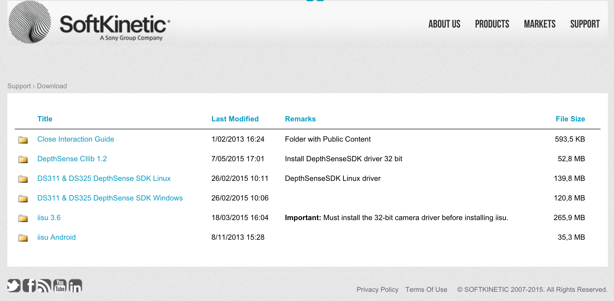

# How to Install

-1. Go to http://softkinetic.com

-2. Register & Login

-3. Go to the "Download" Page

-4. Install 32 bit DepthSense SDK & iisu

-5. Install Unity 5.2.4f1 (32bit)

-6. Connect camera to the USB 2.0 Port (USB 3.0 is not available)

# Libraries

- OpenCV Sharp 3.1
- DepthSense SDK for 32 bit Windows
- iisu 3.6